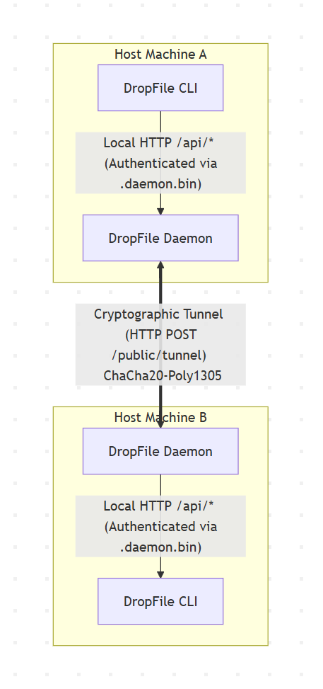
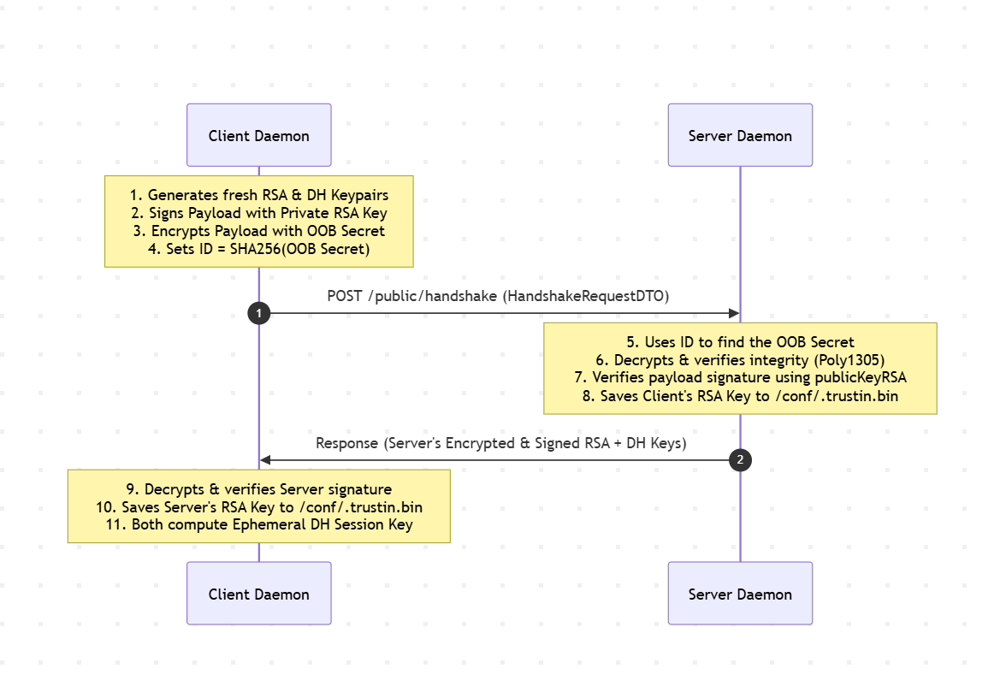
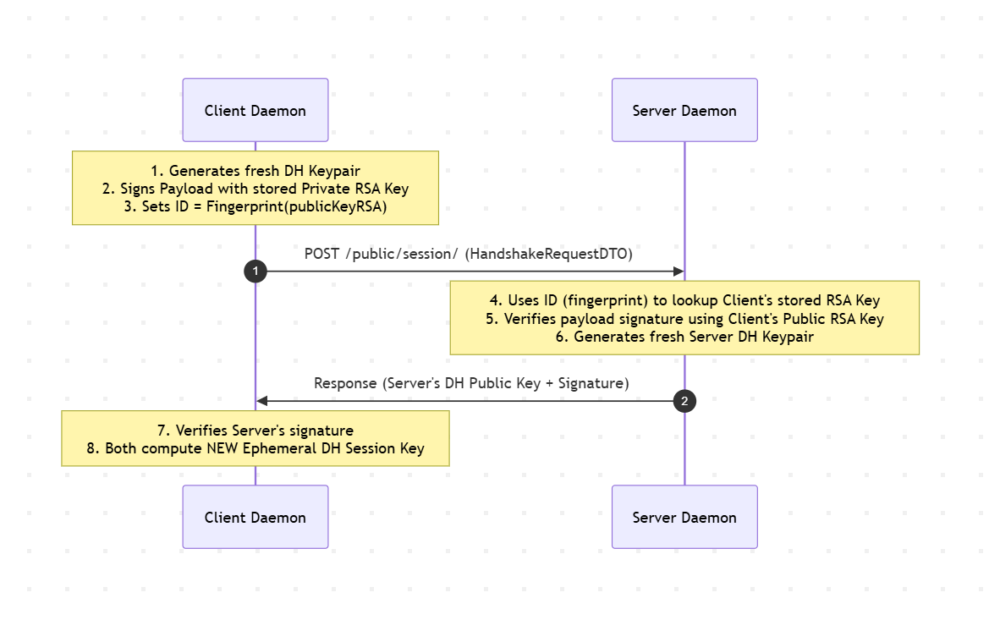
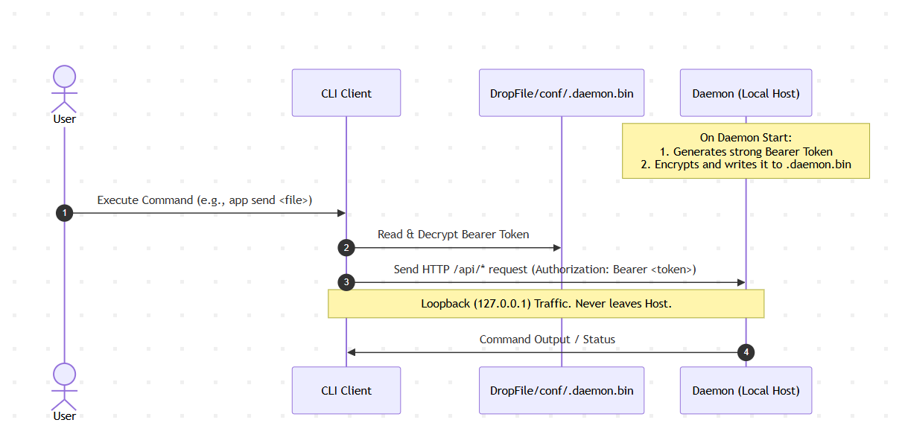

# DropFile
- DropFile is a high-performance, secure peer-to-peer (P2P) file sharing system designed 
to run over untrusted networks without the operational overhead of managing 
external SSL/TLS certificates (HTTPS). By implementing a robust, native cryptographic 
tunnel directly at the application layer, DropFile guarantees absolute confidentiality and 
integrity for your transfers, even when routing over plain, unencrypted HTTP channels.

# ⚡ Ultra-Low Resource Footprint

- DropFile is built to be incredibly lightweight and non-intrusive.
- It doesn't waste CPU cycles on heavy background runtimes or bloatware.

* **Default Resource Profile:**
    * **CPU:** 1 vCPU (Runs perfectly on a single core)
    * **RAM:** 256 MB (Optimized memory footprint with aggressive garbage collection tuning)
* **Zero-Load Idle:** When no transfers are active, the Daemon goes into a deep-sleep polling state, consuming **~0% CPU** and minimal memory.

# 🚀 Performance & Tunnel Benchmarks

The transport tunnel is highly optimized to maximize throughput while keeping resource consumption at a minimum.

### Network Efficiency via Gzip Compression
To maximize network efficiency and payload density,
the tunnel automatically applies **Gzip (GZ) compression** on the sending 
Daemon side before encrypting the data. The receiving Daemon then decompresses the payload on the fly.
This significantly reduces the actual byte size transmitted over the wire,
especially when transferring compressible files (text, databases, uncompressed logs).

### Speed & Resource Scaling
Our benchmarks show how the transfer speed scales depending on the allocated 
system resources (tested over a local loopback `127.0.0.1` interface):

* **Default Config (1 vCPU / 256MB RAM):** Delivers a maximum throughput of **~120 MB/s** (approx. 960 Mbps).
* **Performance Config (Increased CPU & RAM):** Scalable up to **~700 MB/s** (approx. 5.6 Gbps) on capable hardware.

> 💡 **The Reality of Network Bottlenecks**
>
> While scaling the application resources to reach 700 MB/s looks impressive, **doing so is practically unnecessary in 99% of real-world scenarios**.
>
> The 120 MB/s baseline was measured on a local loopback interface. In actual WAN, LAN, or internet environments, your transfer speed will almost always be capped by physical network bandwidth, routing latency, and packet loss—not the CPU or RAM of the Daemon. The default 120 MB/s limit is already high enough to completely saturate a Gigabit internet connection. Therefore, keeping the default lightweight footprint is the most optimal approach.

# Key Features
- True End-to-End Encryption (E2E): Powered by the state-of-the-art ChaCha20-Poly1305 authenticated encryption algorithm (AEAD).
- Transport Independence: Zero reliance on HTTPS. The cryptographic tunnel natively handles transport security over standard HTTP.
- Dynamic Identity Management: Ephemeral session keys (Diffie-Hellman) combined with persistent, connection-specific authentication keys (RSA).
- Secure Host Isolation: Clean separation between the background service (Daemon) and the command-line interface (CLI) using a self-rotating, local-only token mechanism.

# System Topology
- DropFile splits responsibilities between a localized controller (`CLI`) and a persistent network worker (`Daemon`). 
- The network communication between daemons is fully encrypted, while the control plane is strictly bound to the local loopback interface.


# Daemon-to-Daemon Cryptographic Tunnel
The core strength of DropFile is its ability to route high-volume file transfers over unencrypted networks (like standard HTTP)
without exposing data to eavesdropping or tampering.
- No HTTPS Required: Standard HTTPS relies on a centralized PKI (Public Key Infrastructure) and Certificate Authorities.
DropFile bypasses this dependency entirely. By encrypting payloads directly with ChaCha20-Poly1305 at the application layer,
intermediate routers see only binary cryptographic noise.
- Why ChaCha20-Poly1305? It is a modern Authenticated Encryption with Associated Data (AEAD) algorithm.
It provides both confidentiality (ChaCha20) and tamper-proof integrity verification (Poly1305) in a single pass.
It is exceptionally fast in software implementations, making it ideal for high-throughput file-sharing.
- The Public Tunnel: All encrypted payloads are sent via a single, public endpoint: `POST /public/tunnel`.

# Handshake Protocol & Trust Establishment

Before any file transfer can begin, both Daemons must establish trust and derive shared cryptographic secrets. This process is fully containerized inside the `HandshakeRequestDTO` and occurs across the `/public/handshake` and `/public/session/` endpoints.

### Scenario A: Initial Bootstrapping (Using Out-of-Band Secret)
This flow occurs during the very first connection. It establishes a secure channel using a manually shared temporary password (OOB Secret).

```java
public record HandshakeRequestDTO(
    String id,          // OOB Secret Hash OR Client RSA Fingerprint
    byte[] payload,     // Encrypted Payload (ChaCha20-Poly1305)
    byte[] nonce,       // Unique IV for encryption
    byte[] signature    // Payload signed with Client's Private RSA Key
) {}

// Decrypted structure of the payload
public record Payload(
    byte[] publicKeyRSA,
    byte[] publicKeyDH,
    long timestamp
) {}
```


### Scenario B: Initial Bootstrapping (Using Out-of-Band Secret)
Once trust is established and RSA keys are saved, the manual OOB secret is no longer required.
When either daemon restarts or a session expires, they perform a password-less handshake via /public/session/.


# Cryptographic Lifecycle
- The Pre-Shared Secret (Bootstrap): To initiate the first-ever connection, you must manually share a temporary,
out-of-band secret (e.g., via a secure chat or QR code). This secret is used to encrypt the initial `/public/handshake` payload.
- Diffie-Hellman (Session Keys): During the handshake, a Diffie-Hellman (DH) exchange occurs.
- The resulting symmetric keys are used to encrypt the current session's traffic. These keys are ephemeral, reside strictly in volatile RAM,
and are destroyed when either daemon restarts.
RSA Keys (Long-Term Identity): To avoid entering the manual secret every time,
a unique RSA Key Pair is generated per unique connection pair (e.g., the key pair for `A <-> B` is completely different from `B <-> C`).
- Zero-Secret Reconnection: Long-term RSA keys are saved locally on each host in an encrypted file at `conf/.trustin.bin`.
Upon a daemon restart, the initiators can safely reconnect to trusted peers without requiring the original manual secret.
The system performs a mutual RSA signature challenge to verify identities and negotiates a fresh ephemeral DH session key.

# CLI-to-Daemon Local Control Plane
To control the daemon, users interact with the lightweight `CLI` client. Since both components normally reside on the same physical host,
their authentication and transport model is optimized for local loopback efficiency.

# Security Considerations
- The Daemon Token: The Daemon controls its management API (`/api/*`) using standard Bearer Token authentication.
To prevent static token reuse vulnerabilities,
the Daemon regenerates this token on every single startup and writes it in an encrypted state to `DropFile/conf/.daemon.bin`.
- CLI Automatic Authentication: When you run a CLI command, the CLI dynamically reads `conf/.daemon.bin`,
decrypts the token, and automatically appends it to the HTTP headers. No manual login is required.
- Loopback Transport Safety: Because the CLI and the Daemon reside on the same computer,
this control traffic travels strictly over the local loopback interface (`127.0.0.1`).
Even though this local traffic is unencrypted, it never exits the physical machine, meaning it cannot be intercepted by network sniffers.
- Multi-Host CLI Scaling: If your infrastructure requires running the CLI on a different machine than the Daemon,
the `/api/*` endpoints can be exposed remotely. However, because local loopback guarantees are lost,
you must wrap the remote `/api/*` endpoints in an external secure layer (e.g., HTTPS reverse proxy or wireguard tunnel) to prevent credential sniffing.


# Technical Specifications

| Parameter            | Selected Standard / Technology                                                                      |
|----------------------|-----------------------------------------------------------------------------------------------------|
| Symmetric Encryption | ChaCha20-Poly1305 (AEAD)                                                                            |
| Asymmetric Identit   | RSA (Connection-specific, persistent)                                                               |
| Key Agreement        | Diffie-Hellman (DH) (Session-specific, ephemeral)                                                   |
| Local Store Path     | `conf/.trustin.bin` `conf/.trustout.bin` (Peer Trust Store), `conf/.daemon.bin` (Local Token Store) |
| Control Plane Auth   | Cryptographically rotated Bearer                                                                    |


# Installation
```
There are 4 versions: x64 windows, macos, linux and portable version.
1. The portable version has no runtime and 
requires installed java 25 or higher on the host machine.
2. X64 versions include runtime and can go without any preparation
```

# Support
The application can run on any platform where Java 25 or higher exists.
Tested on: Windows 11-10 x64, WSL2, DebianX64, MacosX64, Termux(Android)

#### Windows
Add DROPFILE_HOME env var and update the PATH. See Linux/MacOS

#### Linux/MacOS
The executable files ``/bin/dropfile and /bin/dropfile-daemon`` may ask the permissions to execute
1. Unzip project ``/home/user/dropfile-linux``
2. ``tar -xzvf dropfile-linux.tar``
3. There are three ways how to work with the application: Add environment variable, symlink, execute executable script from the bin directory
4. Environment variable. Add env var and update the path. The process is similar to maven
```
#1 Environment variable
export DROPFILE_HOME=~/dropfile-linux
export PATH=$PATH:$DROPFILE_HOME/bin
```
```
#2 Symlink
Create symlink to ~/.local/bin
$ ln -sf "$HOME/dropfile-linux/bin/dropfile" "$HOME/.local/bin/dropfile"
```
```
#3 Direct execution
$ ./dropfile/bin/dropfile
```
5. Go to the command line ``$ dropfile``
6. Result 
```
░███████                                      ░████ ░██░██
░██   ░██                                    ░██       ░██
░██    ░██ ░██░████  ░███████  ░████████  ░████████ ░██░██  ░███████
░██    ░██ ░███     ░██    ░██ ░██    ░██    ░██    ░██░██ ░██    ░██
░██    ░██ ░██      ░██    ░██ ░██    ░██    ░██    ░██░██ ░█████████
░██   ░██  ░██      ░██    ░██ ░███   ░██    ░██    ░██░██ ░██
░███████   ░██       ░███████  ░██░█████     ░██    ░██░██  ░███████
                               ░██
                               ░██

Daemon host: 127.0.0.1
Daemon port: 18181
Usage: <main class> [-hV] [-ignore-error] [-live] [COMMAND]
  -h, --help          Show this help message and exit.
      -ignore-error, --ignore-error
                      Continue polling even if the command encounters an error
      -live, --live   Run this command in live update mode
  -V, --version       Print version information and exit.
Commands:
  connections, -c, --c                      Connections
  daemon                                    Daemon commands
  quick-share, quickshare, -quickshare, --quickshare, -q, --q
                                            Quick share
```
# Termux(Android)
The Termux installation requires java-25 or higher on the host(termux) machine.
Build the portable version
1. use ``$ ./full-install.sh`` which installs java-25
2. use ``$ ./nano-install.sh`` in case you already have java-25
3. Finally, you will get symlink ``$ dropfile``

# Examples
First of all it's necessary to start its daemon
```
$ dropfile daemon start
$ dropfile daemon status
```
#### Daemon commands
```
dropfile daemon
Usage: <main class> daemon [COMMAND]
Daemon commands
Commands:
  shutdown     Daemon shutdown
  status       Daemon status
  start        Daemon start
  cache-reset  Daemon cache reset
```

#### Connections
```
dropfile connections
Usage: <main class> connections [COMMAND]
Connections
Commands:
  connect, -c, --c                   Connect
  current                            Retrieve current connection
  trusted-in, --in, -in, --i, -i     Retrieve trusted-in connections
  trusted-out, --out, -out, --o, -o  Retrieve trusted-out connections
  disconnect                         Disconnect trusted-out connection
  revoke                             Drop trusted-in connection
  access, -a, --a                    Access keys command
  status                             Retrieve status of current connection
  share, -s, --s                     Share operations
  traffic                            Retrieve traffic
```
Generate access token, and use the access key via connect command

```
$ dropfile connections access generate

{
  "id" : "b451ef733318a553",
  "key" : "OVVac3h0eHU5Rzl1MUh5cQ",
  "created" : "2026-03-29 10:39:29"
}

$ dropfile connections connect 192.168.1.5:18181 OVVac3h0eHU5Rzl1MUh5cQ
```

# 📱 Quickshare (Ad-Hoc File Sharing)

Sometimes, establishing a full-blown P2P cryptographic tunnel with handshakes and long-term RSA keys is overkill. If you just need to quickly beam a photo to your smartphone, share a PDF with a colleague on the same Wi-Fi, or grab a log file from a remote server, **Quickshare** is the perfect tool.

Instead of registering permanent peers, Quickshare temporarily exposes an ad-hoc download endpoint on your Daemon, complete with auto-generated security wrappers, single-use self-destruction, and CLI-rendered QR codes for seamless mobile scanning.

### How It Works

When you share a file, the local CLI talks to your Daemon to spin up a temporary route. If your host machine has an active network interface, the CLI will automatically render a **QR Code directly in your terminal** for instant wireless sharing.

```text
  [ Host Machine ]                                       [ Receiver Device ]
  ┌────────────────────────┐                             ┌─────────────────┐
  │  dropfile quickshare   │                             │  Camera App     │
  │     (Spins up temporary│ ─── Renders QR Code ──────> │  (Scans QR)     │
  │      HTTP endpoint)    │                             └────────┬────────┘
  └───────────┬────────────┘                                      │
              │                                                   ▼
              └═══════════════ Downloads secure-XXX.zip ══════════╝
                              (Decrypted with shown password)
```
By default, Quickshare operates under strict security assumptions to protect your data even over unencrypted LAN/HTTP channels:
- Double-Archived Security: The file is packed inside a double-nested archive (secure-XXX.zip).
- Auto-Generated Passwords: The inner archive is encrypted with a strong, random password printed in your terminal next to the QR code.
- Single-Use Ephemerality: The download link is strictly single-use. The moment the file is fully downloaded, the Daemon destroys the route and wipes the temporary archives from disk.

#### Default Secure Share (Single-use, Encrypted, Auto-password)
   Ideal for sharing sensitive files securely over untrusted local networks
```
$ dropfile quickshare add -f C:\\cat_photo.img
```
```
{
    "id" : "fc35c9ba35",
    "alias" : null,
    "resourcePath" : "C:\\cat_photo.img",
    "size" : "715B",
    "secret" : "i7vVW3_4kB5R03Ge",
    "relative" : "p/qs/fc35c9ba35",
    "external" : [ ],
    "wireless" : [ "http://192.168.1.10:18181/p/qs/fc35c9ba35" ],
    "ethernet" : [ "http://187.40.140.10:18181/p/qs/fc35c9ba35" ],
    "secure" : true,
    "singleUse" : true,
    "expired" : false,
    "updated" : "2021-01-01 01:34:19",
    "created" : "2021-01-01 01:34:19"
}

Connection type WIRELESS
Scan this QR code to download: URL http://192.168.1.10:18181/p/qs/fc35c9ba35
```


#### Raw Transfer (As-Is, No Encryption)
Use this when sharing non-sensitive files,
or when downloading to a device that cannot easily extract ZIP files (like some smart TVs or embedded devices).
```
$ dropfile quickshare add -f C:\\cat_photo.img -secure false
```
- What happens: The file is exposed directly over HTTP "as is" (raw). No ZIP creation, no compression, and no password required.

#### Persistent Multi-Use Sharing
Perfect when you need to share a file with multiple people at once (e.g., during a team meeting) or download it onto several devices.
```
$ dropfile quickshare add -f C:\\cat_photo.img -single-use false
```
- What happens: The link remains active indefinitely.
The Daemon will keep serving the file until you manually delete the share or stop the Daemon.

#### Custom Passphrase
If you want to use a memorable password instead of a randomly generated string.
```
$ dropfile quickshare add -f C:\\cat_photo.img -secret 1234
```
- What happens: The file is packed into a standard secure archive (secure.zip) encrypted with the custom password you provided (e.g., 1234).

# Docker build
The Docker build is absolutely isolated from the host machine. There is no need to install anything except docker.
Once the sources downloaded, execute script to build X64 or a portable version.
The application archive will be appeared in "DropFile/release" directory. 
dropfile-windows.tar.gz, dropfile-linux.tar.gz, dropfile-macos.tar.gz, dropfile-portable.tar.gz
Windows
```
$ ./DropFile/release/release.windows.x64.bat
```
Linux/WSL
```
$ ./DropFile/release/release.linux.x64.sh
```
MacOS
```
$ ./DropFile/release/release.macos.x64.sh
```
portable
```
$ ./DropFile/release/release.linux.x64.sh
```
